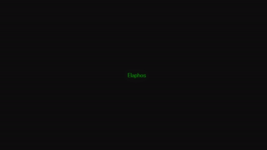
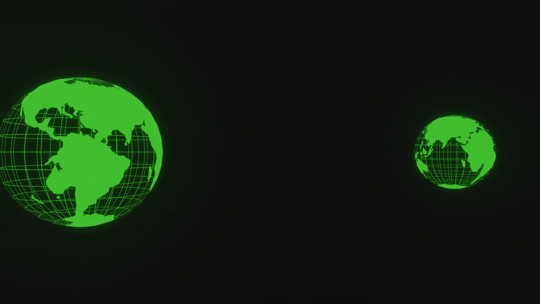

# Elaphos-Animation-Toolkit
An animation toolkit written in Rust using the Bevy game engine.
## Features
- Event and Tag based animation of objects
- Translation animation
- Rotation animation
- Fading of sprites and text
- Changing of background colour
- Animation of gltf scenes
## What can this be used for
I wrote this library to use for interactive video animations.
This uses the Bevy game engine to perform the animations.
I can also imagine this being used for in game animations, if you use the Bevy game engine.
## Future goals
- More animations/animation options (e.g. acceleration and deceleration for objects)
- Data driven animations
  - E.g. a toml/json file containing the objects in the scene with their initial parameters and the animation steps.
- Based on the data driven animation tooling maybe a visual editor
## Examples
See the '/examples'. 
### Slideshow
Contains an example how to use the toolkit for a 2D slideshow.

### 3d
Shows how to perform some operations on 3D objects.

## Changelog
### 0.1.1
#### Features
- Added support for 3D scenes
- Added examples section

## Credits
For the example files I used some freely available resources.
- "Earth Hologram" - 3D Model (https://skfb.ly/o9Eoy) by Rafael Rodrigues is licensed under Creative Commons Attribution (http://creativecommons.org/licenses/by/4.0/).
- "Jupiteroid" - Font (https://www.fontspace.com/jupiteroid-font-f90261) by GGBotNet is licensed under Creative Commons Zero v1.0 Universal / Public Domain (https://creativecommons.org/publicdomain/zero/1.0/)